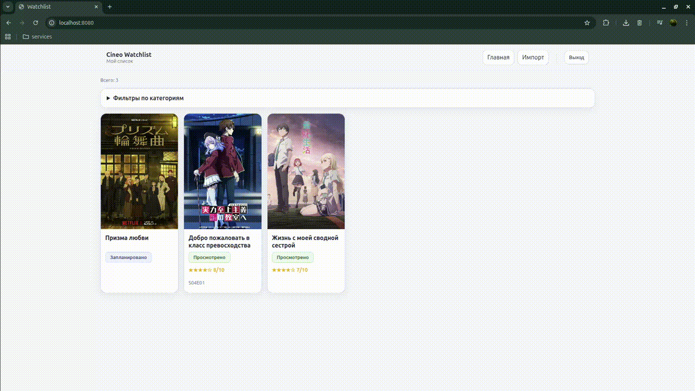

# Cineo



**Cineo** — локальное self-host приложение для персональной фильмотеки. Хранит фильмы и метаданные исключительно локально, без облаков.

## Возможности

- Организация и каталогизация локальных фильмов
- Управление коллекцией через веб-интерфейс
- Полностью офлайн, приватность и контроль данных

---

## Быстрый старт
### Режим разработки (для разработчиков)

```bash
cp .env.example .env
```

```bash
make dev-docker-up
make dev-migrate
make dev-createsu
```

Запустите приложение и celery worker в двух терминалах:

```bash
make dev-run
```

```bash
make dev-celery-run
```

**Сервисы (DEV):**
- Приложение: `http://127.0.0.1:8000`
- PostgreSQL: `localhost:5432`
- Redis: `localhost:6379`

---

### Production-like запуск (для пользователей)

```bash
cp .env.example .env
docker compose up -d --build
```

Опционально создайте администратора:

```bash
docker compose exec web python manage.py createsuperuser
```

**Сервисы (Docker):**
- Приложение: `http://localhost:8000`
