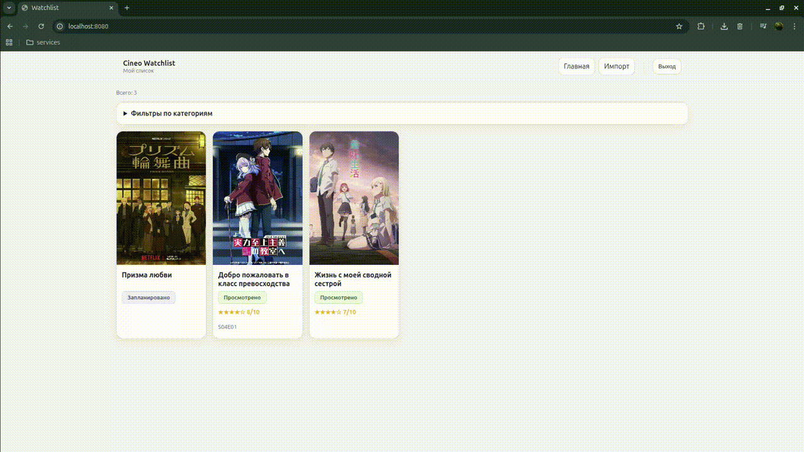

# Cineo



**Cineo** — локальное self-host приложение для персональной фильмотеки. Хранит фильмы и метаданные исключительно локально, без облаков.

## Возможности

- Современный веб-интерфейс (React SPA, тёмная тема): дашборд статистики, таблица с настраиваемыми колонками или сетка постеров
- Добавление по названию (поиск с автодополнением) или по ID КиноПоиска
- Фильтры по категориям и статусам в выезжающей боковой панели
- Кэш сырых ответов провайдера: повторное добавление тайтла не дёргает внешний API
- Полностью офлайн, приватность и контроль данных

Стек: Django + Django REST Framework, PostgreSQL, Celery + Redis (бэкенд `/api/`); React + Vite + TanStack (фронтенд `frontend/`).

---

## Быстрый старт

### 1) Режим разработки (для разработчиков)

Подход: инфраструктура (Postgres/Redis) в Docker, Django и Celery запускаются локально через `make`.

1. Подготовьте переменные:

```bash
cp .env.example .env
```

2. Поднимите инфраструктуру и примените миграции:

```bash
make dev-docker-up
make dev-migrate
make dev-createsu
```

3. Запустите бэкенд (Django) и Celery worker:

```bash
make dev-run
```

```bash
make dev-celery-run
```

4. Запустите фронтенд (React SPA) — Vite dev-сервер с проксированием `/api`:

```bash
make front-install   # один раз
make dev-front
```

**Сервисы (DEV):**
- Интерфейс (Vite): `http://localhost:5173`
- API (Django): `http://127.0.0.1:8000/api/`
- PostgreSQL: `localhost:5432`
- Redis: `localhost:6379`

> В dev открывайте `http://localhost:5173` — Vite проксирует `/api` на Django, поэтому авторизация (session + CSRF) работает прозрачно. В Docker-сборке SPA собирается автоматически (multi-stage) и отдаётся самим Django на `http://localhost:8000`.

---

### 2) Запуск для пользователей (готовый образ)

Локальная сборка **не нужна** — образ публикуется в GitHub Container Registry и тянется автоматически. Нужен только Docker Compose.

```bash
# понадобится только эти два файла + .env
cp .env.example .env       # заполните SECRET_KEY и PROVIDER_API_KEY
docker compose up -d
```

Миграции и сборка статики выполняются автоматически при старте. Опционально создайте администратора:

```bash
docker compose exec web python manage.py createsuperuser
```

**Сервисы (Docker):**
- Приложение: `http://localhost:8000`

> Закрепить версию образа: задайте `CINEO_TAG=v0.1.0` в `.env` (по умолчанию `latest`).
> Собрать образ из исходников локально (для разработки):
> `docker compose -f docker-compose.yml -f docker-compose.build.yml up -d --build` (или `make docker-build`).

---

## Конфигурация (.env)

Ниже рекомендуемые значения для двух режимов: `dev` (локальный запуск кода) и `prod-like` (запуск через `docker compose`).

| Переменная | Комментарий | Рекомендуется для DEV                         | Рекомендуется для PROD-like |
| --- | --- |-----------------------------------------------| --- |
| `SECRET_KEY` | Секрет Django | Любой локальный ключ                          | Уникальный длинный ключ |
| `DEBUG` | Режим отладки Django | `True`                                        | `False` |
| `LOG_LEVEL` | Уровень логирования | `INFO`                                        | `INFO` или `WARNING` |
| `ALLOWED_HOSTS` | Разрешенные хосты | `localhost 127.0.0.1`                         | Домен/хост сервера (без протокола) |
| `CSRF_TRUSTED_ORIGINS` | Разрешенные origin для CSRF | `http://localhost:8000 http://127.0.0.1:8000` | `https://your-domain.com` |
| `POSTGRES_DB` | Имя БД | `media`                                       | `media` |
| `POSTGRES_USER` | Пользователь БД | `postgres`                                    | Отдельный пользователь с сильным паролем |
| `POSTGRES_PASSWORD` | Пароль БД | `postgres`                                    | Сложный пароль |
| `POSTGRES_HOST` | Хост Postgres | `127.0.0.1`                                   | `postgres` |
| `POSTGRES_PORT` | Порт Postgres | `5432`                                        | `5432` |
| `CELERY_BROKER_URL` | Redis для Celery | `redis://127.0.0.1:6379/0`                    | `redis://redis:6379/0` |
| `CELERY_RESULT_BACKEND` | Backend результатов Celery | `redis://127.0.0.1:6379/0`                    | `redis://redis:6379/0` |
| `PROVIDER_API_KEY` | API-ключ внешнего провайдера | Ваш тестовый ключ                             | Рабочий ключ |

> Примечание: API_KEY для текущего провайдера (`kinopoisk`) можно [получить тут](https://kinopoiskapiunofficial.tech/profile)

---

## Полезные команды

```bash
make dev-docker-down   # остановить Postgres/Redis для dev
make dev-docker-logs   # логи Postgres/Redis для dev
docker compose down    # остановить весь docker-стек
make docker-logs       # логи web и celery в docker-режиме
```
